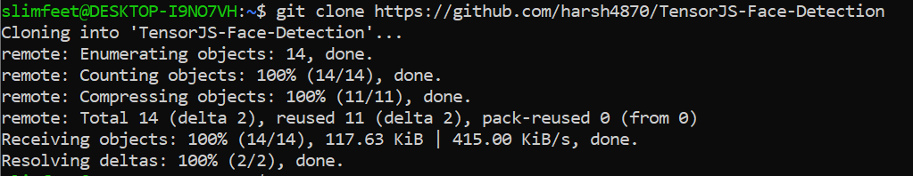
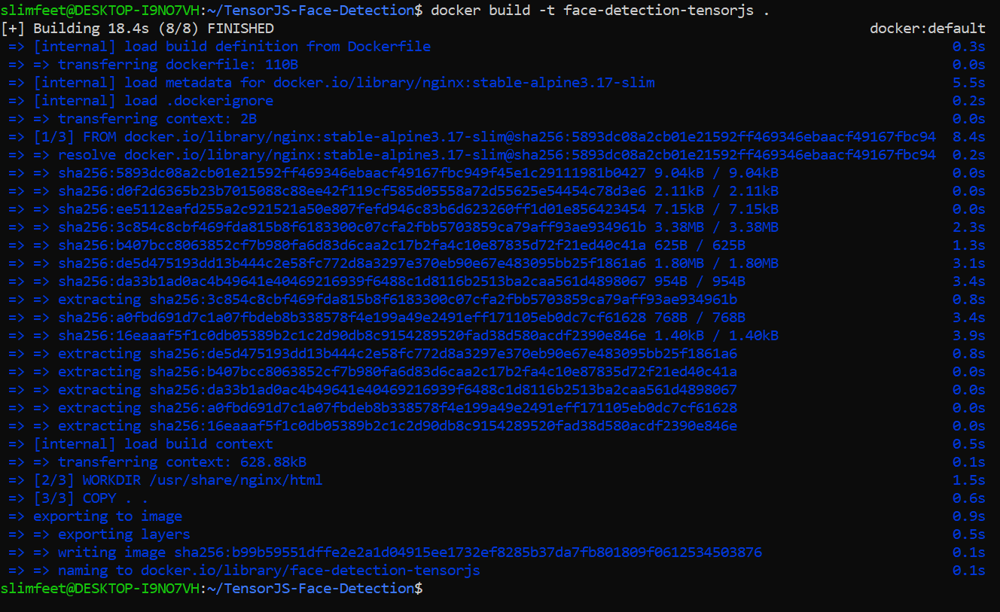
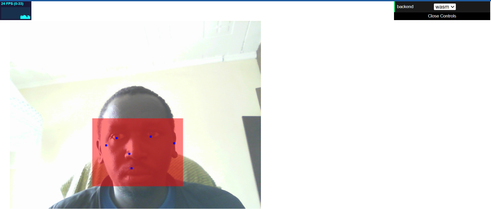
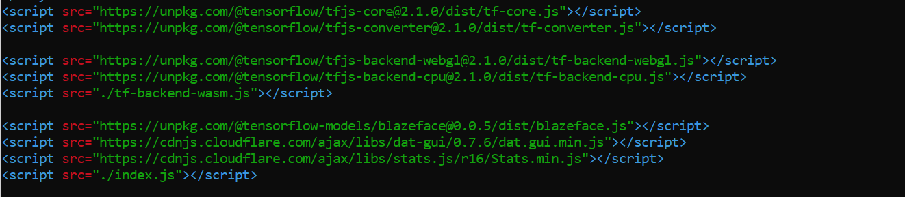
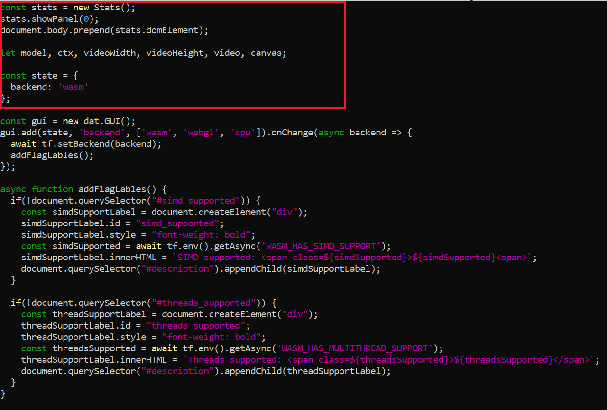
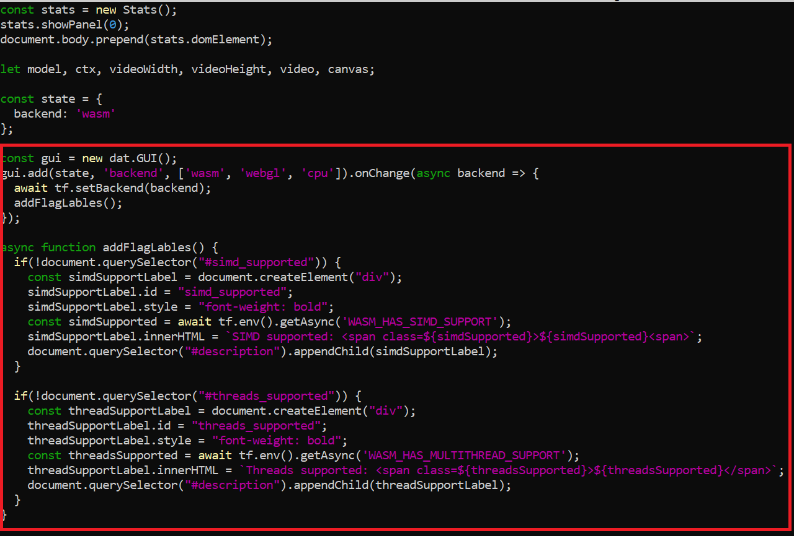
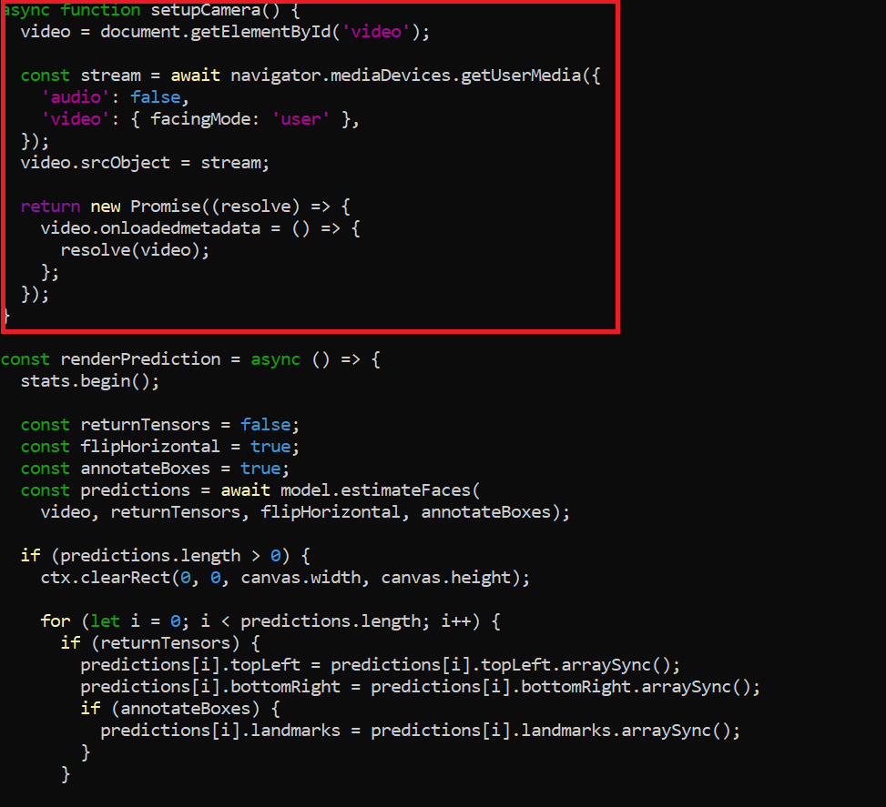
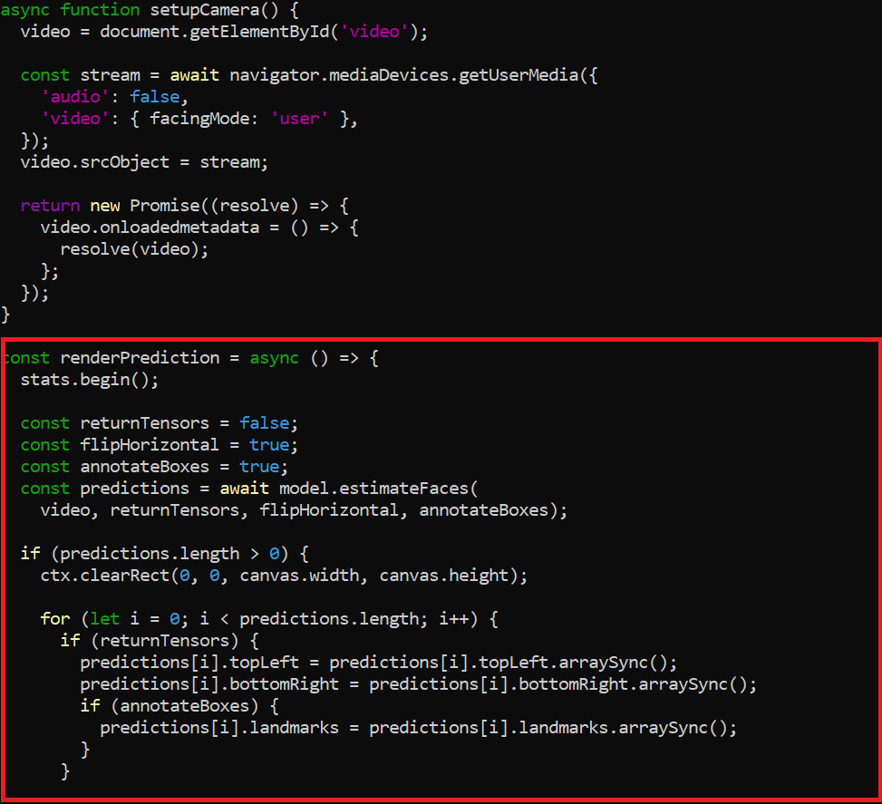

# Running a Face Detection Tensorflow App with Docker
This project demonstrated the seamless integration of Tensorflow.js with Docker for the purpose of testing a Face Detection application. The learning outcomes from this project included:  
- Implementation of a face detection web application with TensorFlow.js
- Containerization of a TensorFlow.js application using Docker
## Step 1: Clone the Face Detection Web App

This gets the application files copied to the local machine. 
## Step 2: Build the App into a Docker Image

It is necessary that before running the application as a container, its important to build it into an image. Ensure you are in the TensorJS-Face-Detection directory when building the docker image. Name the image face-detection-tensorjs
## Step 3: Run the image as a Container
`docker run -p 80:80 face-detection-tensorjs`
This command runs the container and maps it to port 80 in the container, and port 80 on my local machine.
## Step 4: Access the App on port 80

When accessing http://localhost:80, the user is prompted to allow access to camera. Upon approving access, the face detection app triggers begins face detection, as shown in the visible land marks and the reddish rectangular frame. 

# Unpacking the Application
Tensorflow is a web-based machine learning framework backed by three different backend engines that are prompted based on the workload at hand. WASM, WebGL and CPU execute operations based on different metrics or resources that are available on modern browsers. 
- WASM - low-level assembly like language that is compact enough to run on near native speed in ordinary web browsers. Best for high-performance needs without having to rely on GPU.
- WebGL - its an API which allows for GPU accelerated usage, which incorporates physics and image processing. Best suited for parralelized workloads which can benefit greatly from GPU acceleration. Its commonly used in deep learning models which require convolutions and matrix-multiplications.
- CPU - is purely javascript execution based on the local machine's capability. Best serves as a fall back when WASM and WebGL fail.   

# Exploring the Face Detection App Code
## index.html
The front end is served by the index.html file as it serves face detection from the webcam video feed. Notable tensorflow.js machine learning libraries include:

- The tfjs-core and tfjs-converter drive core tensorflow.js functionality and model
- tfjs-backend-webgl, tfjs-backend-cpu, and the tf-backend-wasm facilitate for different computational models for graphic processing. The backends leverage machine learning based on the hardware capabilities of the machine running the app.
- The BlazeFace library, on the other hand, facilitates face detection for the tensorflow model
- dat.GUI provides the needed graphical interface which allows the user to interact with the application in real time.
- Stats.min.js serves performance metrics on screen, e.g the FPS that's displayed on the top left corner of the screen. Helps monitor the efficiency of the application while in use.  
## index.js
  
Stats.js - creates the stats instance which serves to monitor and display the frame rate of the application when in use. 
  
Tensorflow.js - allows switching in between different computational models, based on performance and compatibility of the device running the app.  
  
setupCamera function - its the one that prompts the user to allow webcam to be used by the app based on requests served by the mediadevices web api.
  
Blazeface - this is the model which is relied upon by the render prediction function to detect faces in images. 
## The tf-backend-wasm.js 
Is part of the tensorflow.js library, which serves to initialize the WASM backend, and to interact with WASM binaries.
## The tfjs-backend-wasm-simd.wasm 
Its the WASM binary that is utilized by WebAssembly backend to use SIMD instructions.  
